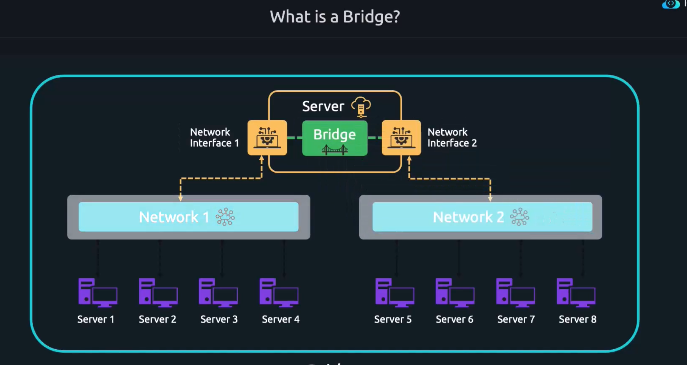
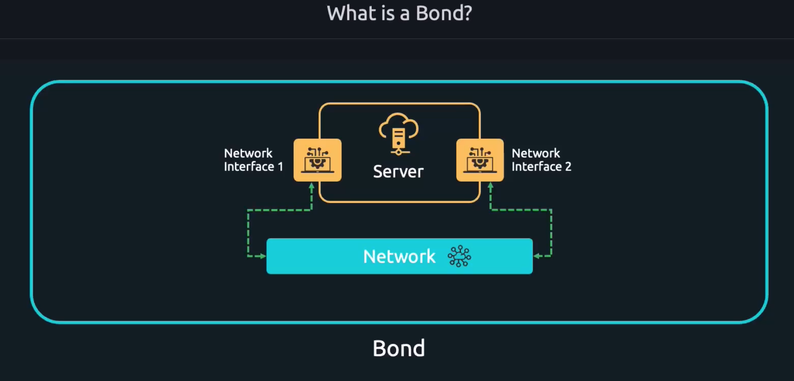

# Bridge

* Build a bridge between Network1 and Network2 
* Let's say a server has two NIC cards and Connecting a two network interface cards is called Bridge. 
* In Linux Networking terms connecting a two networks is also called Controller

# Bond

* Connecting two network interfaces called Bonding
* Even though one of the network interfaces go down another would be there for backup
* Increase the network throughput

## Bonding Modes