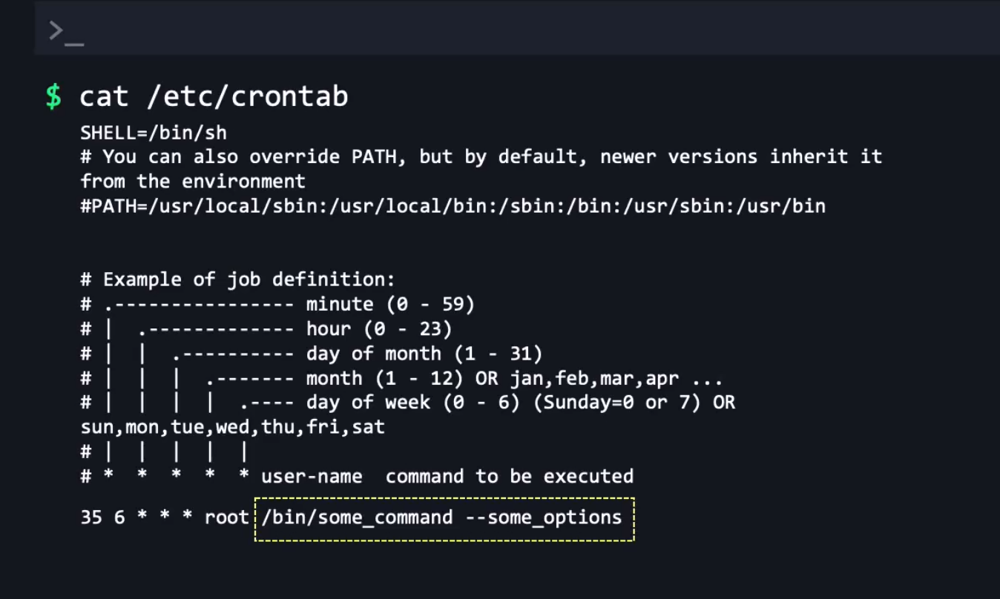

# Scheduling a Task in Linux

* There are different ways in Linux we can schedule a job. 

  1. Cron - If a system is powered on after the cron job time exceeded, that job will NOT run
  2. Anacron - Anacron will check once after the system powered on whether all the scheduled jobs ran fine, no matter what it will run the cron job again
  3. at - For tasks that only run once

***List the Cron jobs*** `crontab -l` - Lists the cronjobs for that user
***Edit the cronjob for the specific user*** `sudo crontab -e -u jane` - Edit the cron job for jane user
***Remove the cron job the user*** `crontab -r` - remove the cronjob for a user
 