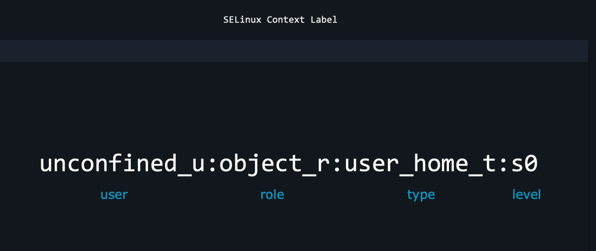

# SELinux

1. Only Certain users can enter certain roles and certain types
2. It lets authorized users and processes do their job, by granting the permissions they need. 
3. Authorized users and processes are allowed to take only a limited set of actions. 

## Commands:

* `id -Z` - Displays the selinux contexts for the user logged in
* `sudo semanage login -l` - To display the seLinux mappings to users.

***Note*** - In Ubuntu there is a different module used instead of SELINUX called apparmor. 

# Ubuntu - How to enable selinux: 
* By default, in Ubuntu system App armor is installed and configured. In order to install selinux, we must first disable the app armor.
* `sestatus` - to check the selinux enabled on our system
* `sudo selinux-activate` - to activate the selinux. Once done, There is a file called .autorelabel created. Which will autorelabel all the files while system is booting up. 
* `getenforce` - reveals the status of selinux modes. Either its `permissive` or `disabled` or `enabled`

**Modes**

* Permissive - It actually not enables anything on the system. However it observes the activities happening in the system. It logs everthing into the audit log. 

* `sudo audit2why --all | less` - Command to check the audit logs whichever is logged in this mode.
* `sudo audit2allow --all -M mymodule` - based on the audit logs it can create a selinux policy module. So that we can apply this to avoid the logs.
* `sudo semodule -i mymodule.pp` - Apply these policy created from the previous command. 
* `sudo chcon -u unconfined_u /var/log/auth.log` - To change the user context of a file.
* `sudo chcon -r object_r /var/log/auth.log`- To change the role context of a file.
* `sudo chcon -t user_home_t /var/log/auth.log` - To change the type context of a file.
* `seinfo -u` - To show the valid user labels
* `seinfo -r` - To show the valid role labels
* `seinfo -t` - To show the valid type labels
* `sudo restorecon -R /var/www/` - Selinux has certain database according to it, using this command we can restore the context for a certain directories. ***Note*** By default it restores the type part according to the database. 
* `sudo restorecon -F -R /var/www/` - Selinux has certain database according to it, using this command we can restore the context =s for a certain directories. ***Note*** It will force restore for user, role and type.
* `sudo semanage fcontext --add --type nfs_t "/nfs/shares/(/.*)?"` - This command updates the selinux database for the specific folder.

