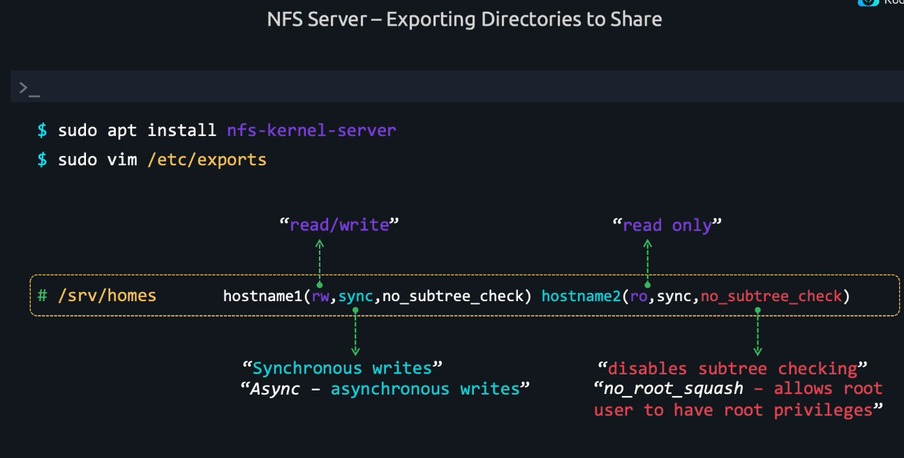
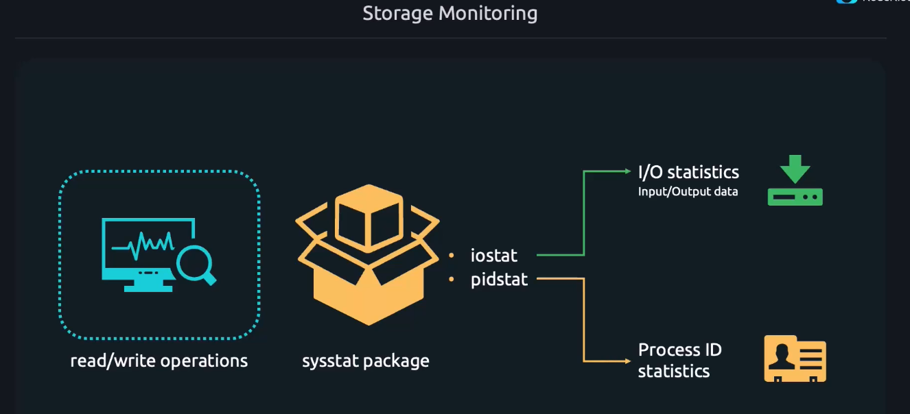
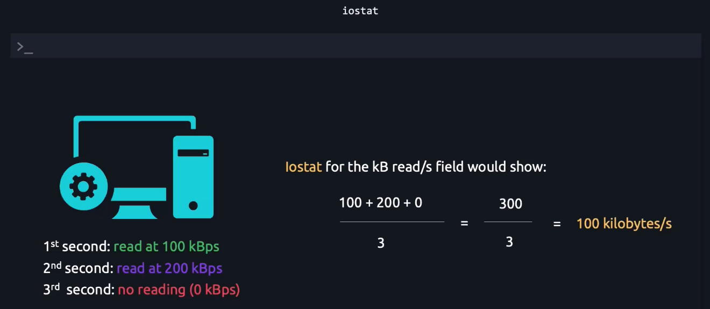
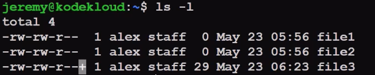

# Create, Delete and Modify the disk partitions

* `lsblk` - List the number of disks and its paritions
* `sudo fdisk --list /dev/sda` - List number of partitions in this disk

## Create and Manage SWAP

* `swapon --show` - To display some swap memories
* `sudo mkswap /dev/sdb3` - Format this partition for swap memory
* `sudo swapon --verbose dev/sdb3` - finalizing it
* `sudo swapoff /dev/sdb3` - Turn off swap
* `sudo dd if=/dev/zero of=/swap bs=1M count=128 status=progress` - In modern Ubuntu meachine in this way we can use a file as a swap memory

## Create and configure the file system
* `sudo mkfs.xfs /dev/vdb1` - Format the partition to xfs format
* `sudo mkfs.ext4 /dev/sdb` - Format the partition to ext4 format
* `sudo mkfs.xfs -L "Backup volume" /dev/sdb1` - Labelling a volume
* `sudo mkfs.xfs -f -i size=512 -L "BackupVolume" /dev/sdb1` - Setting/forcing a inode size to 512MB and also setting up a lableing
* `sudo xfs_admin -l /dev/sdb1` - To list the label for this device
* `sudo xfs_admin -L "newlabelname" /dev/sdb1` - modify a new label name.
* `sudo tune2fs -l /dev/sdb2` - To see the current properties of ext4 file system

## Mounting the file system

* `sudo mount /dev/vdb1 /mnt` - Mounting a partition to a filesystem
* `sudo umount /mnt` - unmount the filesystem
* `sudo blkid /dev/vdb1` - to check UUID of the block device

## File system Mount options

* `findmnt` - Find mount options command lists everything mounted on the system
***/proc*** - Is a file system which mounted only in the RAM
* `sudo findmnt -t xfs, ext4` - It will only show the filesystem related to these types
* `sudo mount -o ro /dev/vdb2 /mnt` - It will mount the file system with Read-Only
* `sudo mount -o ro,noexec,nosuid /dev/vdb2 /mnt` - In this mount options - Its readonly, no program can be executed under this directory, 
* `sudo mount -o remount,rw /dev/vdb1 /mnt` - This is for remounting

***Explanation***

* `ro` Mounts the filesystem as read-only, meaning no write operations can be performed.
* `noexec` Prevents execution of any binaries on the mounted filesystem. This is often used for security reasons.
* `nosuid` Disables the set-user-identifier or set-group-identifier bits. This means that any files on the mounted filesystem with these bits set will not be executed with elevated privileges.

## Remote file system NFS (Network File System)

### Setting up the NFS server

* `sudo apt install nfs-kernal-server` - Install the NFS server package
* `sudo vi /etc/exports` - 

    

    - `no_subtree_check` - Which indicates the NFS server to check the export path and residing files. Sometime if the file is moved or renamed it will throw an error. 
* `sudo exportfs -r` - Basically refreshes the /etc/exports file after the edit.
* `sudo exportfs -v` - shows the verbose output of whats inside the /etc/exports file

### Setting up the NFS client

* `sudo apt install nfs-common` - to install the nfs client utilities

## What does `no_root_squash` do?

Default Behavior (root_squash): By default, NFS changes the root user on the client to the nobody user on the server. This is a security feature to prevent the root user on a client machine from having root privileges on the NFS server.

``no_root_squash``: When you use the `no_root_squash` option, it disables this behavior. This means that the root user on the client machine will have root privileges on the NFS server.

## When to use `no_root_squash`?
Use with Caution: This option should be used with caution because it can pose a security risk. It essentially allows the root user on any client machine to have full control over the files on the NFS server.

Specific Use Cases: It might be used in trusted environments where you need the root user on the client to perform administrative tasks on the server, such as in a controlled lab environment or within a secure internal network.

# Use NBD (Network Block Devices)

## Configure NBD Server

* `sudo apt install nbd-server`
* Edit the nbd configuration file to mention the partition. Once done restart the service
* `sudo systemctl restart nbd-server.service` - Restart the nbd service

## Configure the NBD client

* `sudo apt install nbf-client` - Install the client package
* `sudo modeprove nbd` - Load the kernal module
* `sudo vi /etc/modules-load.d/modules.conf` - Edit this file for the permanent changes
* `sudo nbd-client 127.0.0.1 -N partition2` - Attaching the remote block device to the local
* `sudo nbd-client -d /dev/nbd0` - Remove the block device from the client side
* `sudo nbd-client -l 127.0.0.1` - List the remote block devices on the remote system

## Configure LVM (Logical Volume Management)

* `sudo apt install lvm2` - Install the lvm package
* `PV` - Physical volume or entire disk or partition
* `sudo lvmdiskscan` - Display the lvms
* `sudo pvcreate /dev/sda  /dev/sdb` - Create a physical volumes 
* `sudo pvs` - display the current phsical volumes and its status
* `sudo vgcreate vg-name /dev/sda /dev/sdb` - Create a volume group using available physical volumes
* `sudo vgextend vg-name /dev/sde` - To extend the volumegroup size
* `sudo vgs` - display the volume group details
* `sudo vgreduce vg-name /dev/sde` - remove the physical volume from volume group
* `sudo pvremove /dev/sde` - remove a device from the physcial volume
* `sudo lvcreate --size 2G --name lv-name vg-name` - create a lv partition from the volume group
* `sudo lvresize --extents 100%VG vg-name/lvname` - this command resizes the logical volume lvname in the volume group vg-name to use all the available space in the volume group.
* `sudo lvdisplay` - will display the logical volume's path and properties
* `sudo lvresize --resizefs --size 3G vg-name/lv-name` - if lv has a filesystem on it and you want to resize both lv and filesystem.
* `sudo lvremove volume1/smalldata` - to delete the logical volume

## Monitor the storage devices

* `sudo apt-install sysstat` - install sysstat for monitoring the storage 

    
* `iostat` - tells the summary of how the storage devices are used

    

* `iostat 1` - refreshes every 1 seconds 
* `pidstat -d` - displays which process/command is performing more read/write
* `sudo dmsetup info /dev/dev-0` - dm stands for device mapping
* `iostat -h` - displays the output in a human readable format
* `iostat -p ALL` - tell the device usage for all the partitions

## ACLs (Access Control Lists)

* `sudo apt install acl` - install the acl package
* `sudo setfacl --modify user:jeremy:rw file3` - In this way user jeremy can read/write to the file3

* `+` sign denotes that this file has an ACL permission
* `getfacl file3` - displays the acl settings of it
* `sudo setfacl --modify mask:r file3` - file has maximum of read permission
* `sudo setfacl --modify group:sudo:rw file3` - modify the group sudo permission for file3
* `sudo setfacl --remove-all file3` - remove all the acl entry
* `sudo --recursive -m user:jeremy:rwx dir1/` - set a recursive acl permission for the entire dir
* `sudo --recursive --remove user:jeremy dir1/` - remove a recursive acl permission for the entire dir
* `sudo chattr +a newfile` - this attribute enables the append-only we CANNOT override the file content
* `sudo chattr -a newfile` -  this attribute removes the append-only
* `sudo chattr +i newfile` - this file immutable. Even root user cannot delete/modify/append anything to this file
* `lsattr newfile` - to check the file attribute
* `sudo chattr -i newfile` - to remove this attribute

