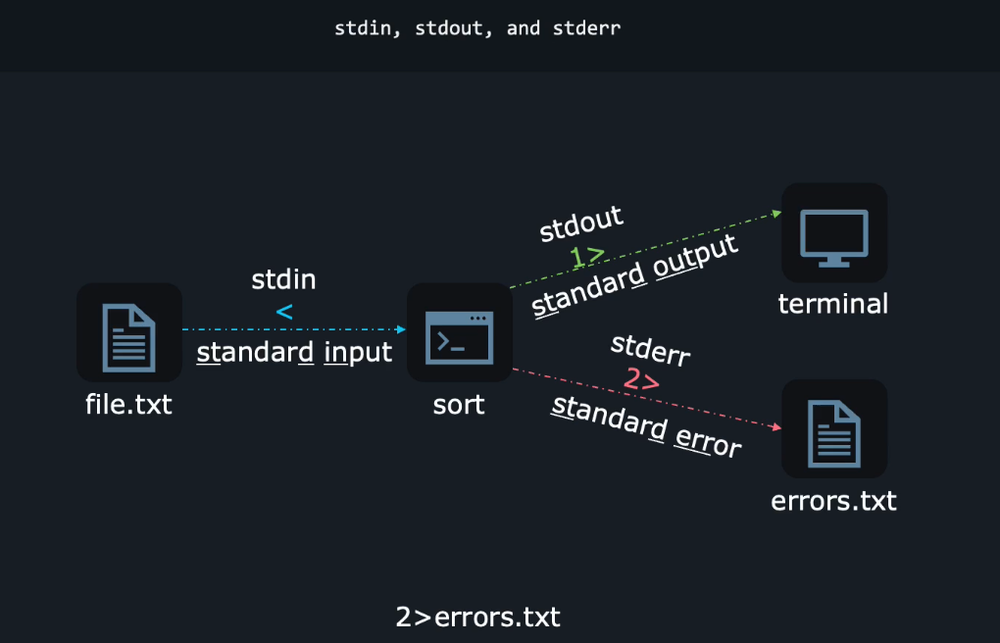

# Linux stdin, stdout and stderr

### Example: 

`grep -r '^The' /etc/ 2>/dev/null`

* In the above command it redirects all the errors or warning to the /dev/null. 
* /dev/null - Is a Linux black hole where all the outputs will be discarded. 

`grep -r '^The' /etc/ 1>Output.txt 2>errors.txt` 

* Above command redirects the stdout, stderr into a two different files